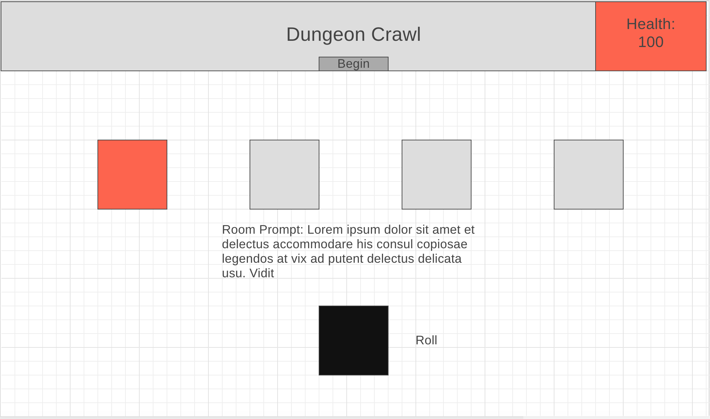
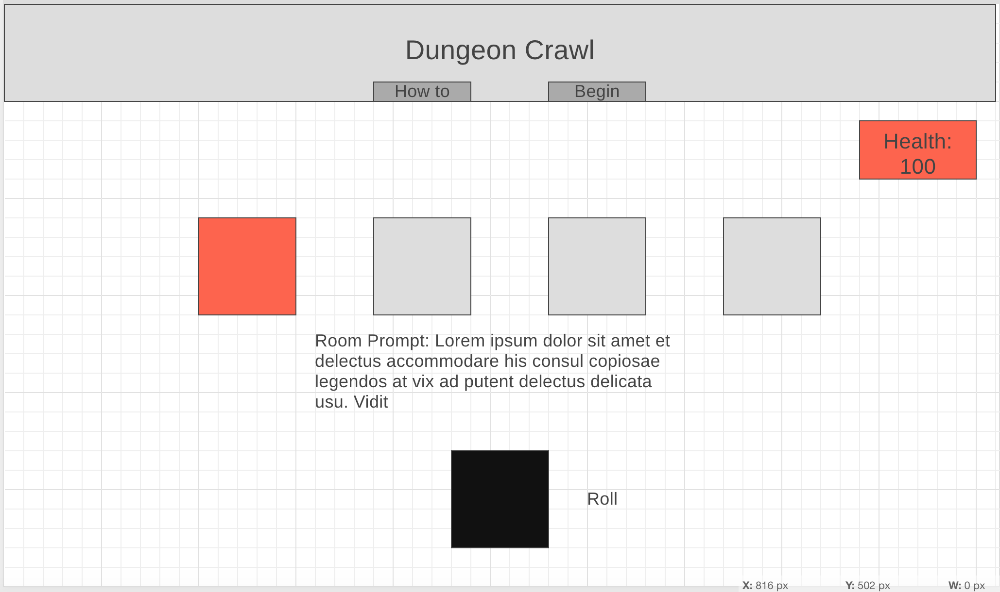
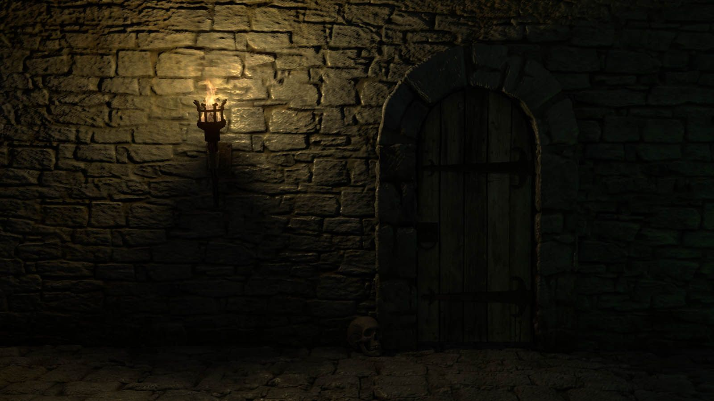
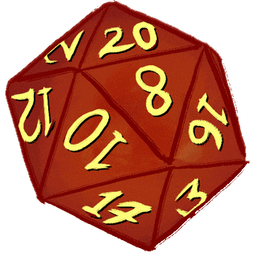
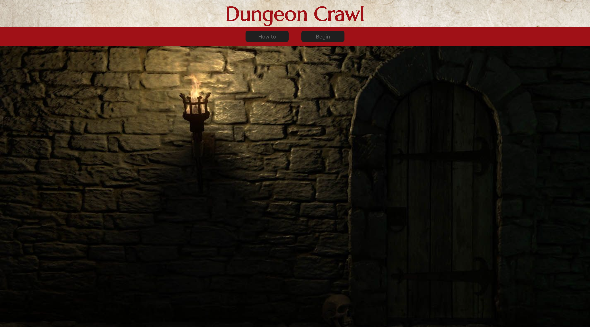
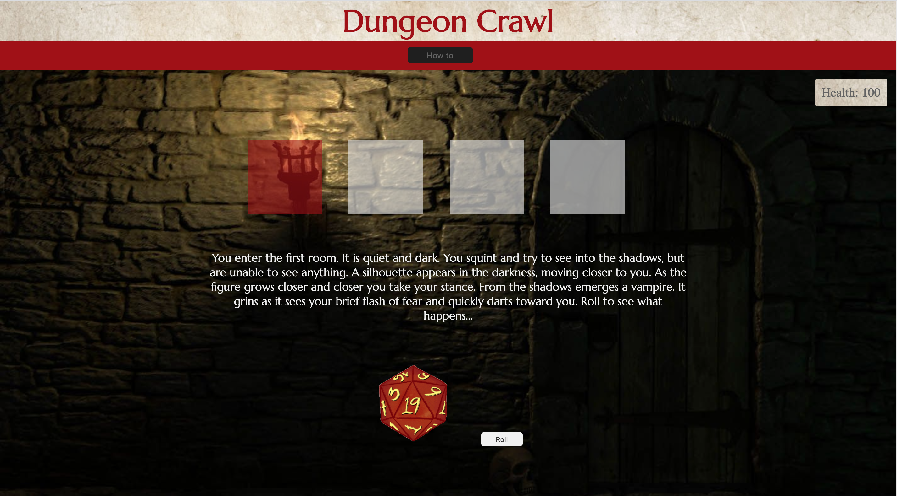

# Dungeon-Crawl
Individual Project at GA

# HTML:
### header 
Top will include the game title "Dungeon Crawl", below will be a button that says "Begin" and on the right your health 

### body
Includes five boxes in a row that will represent the rooms, below the boxes will be the prompt for the round, and below the prompt will be the dice roll with a button 

# CSS:
## Layout!

## Wireframe - Version One

## Wireframe - Version Two

[Wireframe](https://wireframe.cc/hf9ur6)

## ~~Color scheme~~
- ~~skin: #f3f0d1~~
- ~~autumn: #e29c68~~
- ~~orange: #c85108~~
- ~~red: #a20e0e~~

## New Color Scheme
- red: #a20e0e;
- orange: #d15203;
- black: #1f1f1f;
- gray: #636363;
- white: #f1f1f1;
- cream: #ece2ca;

## Background - Header

### Citation:
- “Parchment Paper Background.” Tierra Sur at Herzog Wine Cellars, 2020, https://tierrasuratherzog.com/wedding/ts-wedding-paper-bg/.

## Background - Game-board

### Citation:
- Hidman, Josh. “dungeon wall” pinterest, https://www.pinterest.com/pin/149955862565969694/.

## Dice

### Citation:
- “Top D20 Stickers For Android & IOS” gfycat.com, https://gfycat.com/stickers/search/d20.

## Font 
### Marcellus - Google Fonts

## Final Board - Start

## Final Board - Gameplay

# JS:

## Game Logic

### Start
- User clicks begin button and four squares appear indicating what room you are in. (For room one the first square on the left will highlight a different color than the rest.)
- A prompt will appear below the rooms giving the player a scenrio or scene. 
- Below the prompt will be a 20 sided die
- Next to the die there will a be button the says "Roll"
- Player started with 100 health

### Game play
- After the user clicks roll the die will prompt a random number between 1-20 
- Any number from 1-10 means you take 20 damage
- Any number from 11-20 means you do not take any damage
- There will be an icon in the top of the screen displaying your health through each room
- As the player moves through the rooms their damage taken will increase by 20
- When the roll is done it will log/promt whether you took damage or moved safely through the room
- A "continue" button will appear below the prompt to move to the next room
- Hitting continue will trigger the next room to highlight, the new prompt to appear and the dice to reset

### End
- If your health drops below 0 at the end of any round, the game will be over and a "You died" prompt will appear
- In the fifth and final room you will roll one last time. If your health drops below 0 at the end of this round the game will be over and a "You died" prompt will appear
- If you make it to the fifth room and you roll and your health is above 0 a prompt will appear saying "You Survived!"

## Stretch Goals
- Increase the room count from four.
- Add armor or something to help your heath as you go through the rooms.
- ~~Create a "how to play"~~
- ~~Create a  "reset"~~

## Story
### Room One:
- **Room:** You enter the first room. It is quiet and dark. You squint and try to see into the shadows, but are unable to see anything. A silhouette appears in the darkness, moving closer to you. As the figure grows closer and closer you take your stance. From the shadows emerges a vampire. It grins as it sees your brief flash of fear and quickly darts toward you. Roll to see what happens…
- **Pass:** Anticipating the vampire's quick move, you were able to jump out to the way and dart toward the next room.
- **Fail:** In the shock of seeing your first vampire, you were not able to able to dodge out of the way in time. The vampire latched onto your neck.

### Room Two:
- **Room:** As you shut the door behind you, you peer over your shoulder. You hear what sounds like a glob of goo slopping around on the floor. You see a giant green-opaque slime. It moves from your left to your right, getting closer and closer. You start to run for the next door, but the slime spreads out across the floor. Roll to see what happens…
- **Pass:** You see the slime moving into your path. Just before it completely blocks you in, you leap forward over the slime covered floor, landing just in-front of the door to the next room.
- **Fail:** You attempt to jump over the slime as it crosses your path, but you did not jump high enough. It touches your leg with its acid sludge.

### Room Three:
- **Room:** You enter the next room. A stampede of loud thuds breaks the eerie silence. Your eyes strain to see what could be making the loud noise as the ground shakes under your feet. You see three green-skinned giant trolls emerge from the shadows. You look around the room to see if there is any way to move past them. They spot you and begin moving quickly, each one trying to be the first to get to you. Roll to see what happens…
- **Pass:** You sprint forward and leap, using the trolls as a stepping stone to the chandeliers above you, and swing through the doorway to the next room.
- **Fail:** You sprint forward and attempt to use one of the trolls as a stepping stone to the chandeliers above. The troll immediately noticed what you were doing, biting you and slashing your arm.

### Room Four:
- **Room:** You enter into the final room. Blanketed in complete darkness, you are unable to see anything around you. You hear a rustling of chains in the distance. Moving forward, you grip the wall beside you, using it as a guide. You hear the chains getting louder. Pausing, you hear a low grumble. Suddenly with a flash, the entire room is illuminated. You feel a rush of warmth as fire whips past your face and lights a torch hanging on the wall beside you. A large dragon moves into your focus and you sprint toward the exit. Roll to find out what happens.
- **Pass:** The dragon whips around you trying to block your path, but you anticipate it's moves. You counter any attempts to hit you by jumping, ducking, and dodging out of the way. Right as you open the door to the exit the dragon breaths fire one last time. You leap out of the doorway as fire rushes past you.
- **Fail:** Your pants caught fire as you were trying to escape. As you stopped to pat it out, the dragon whipped around you and smacked you with his tail.
